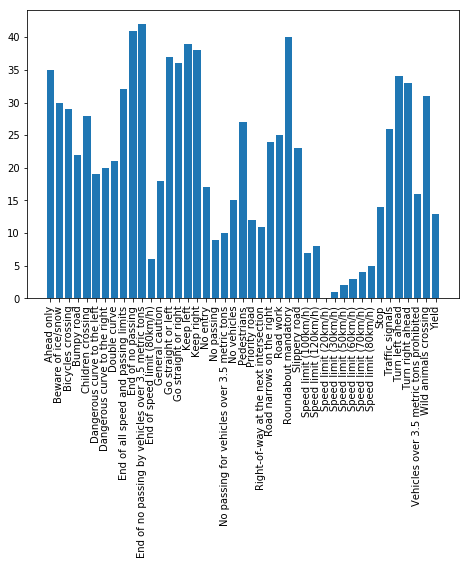
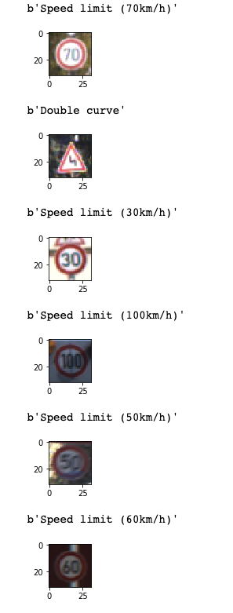
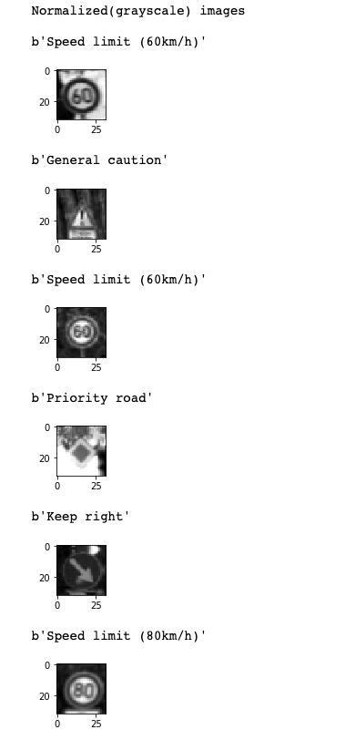
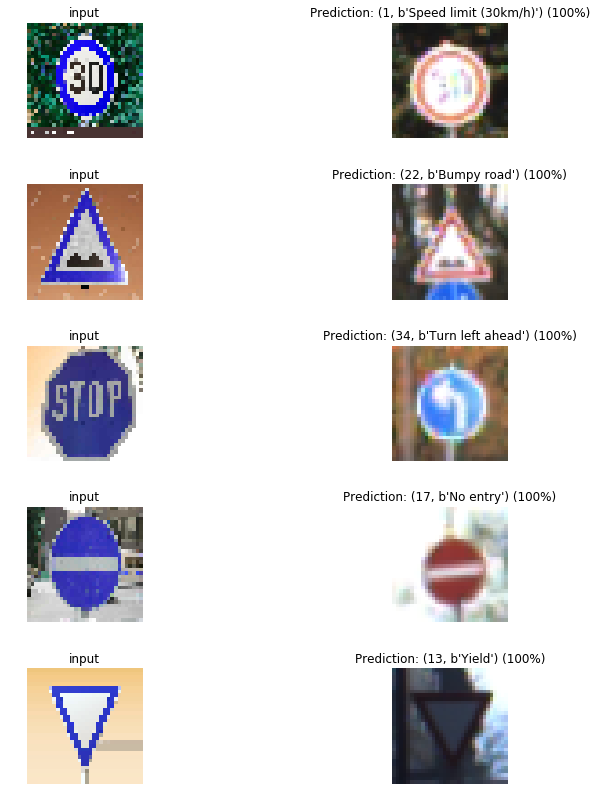
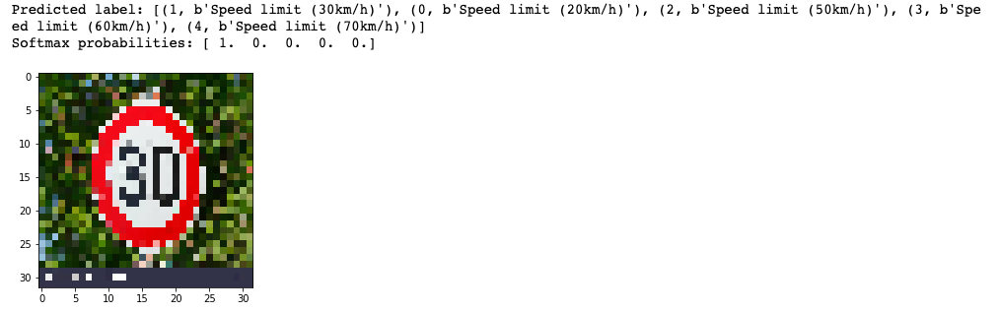
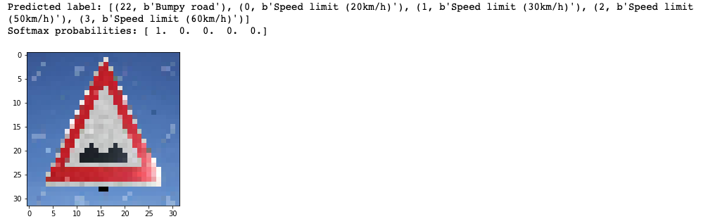
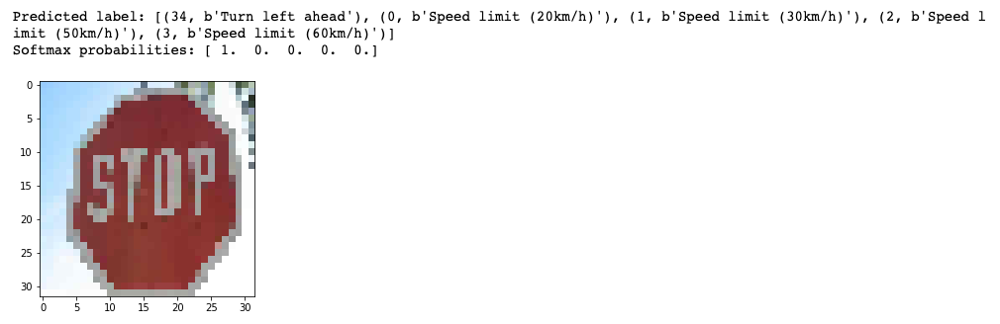
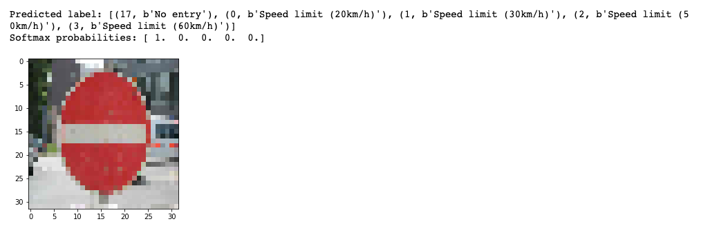
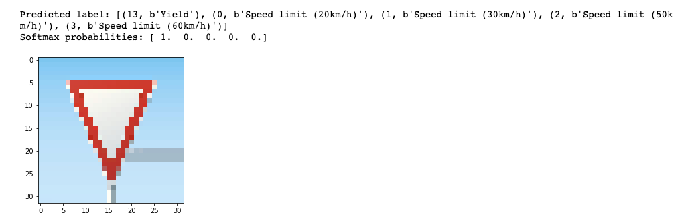

## Project: Build a Traffic Sign Recognition Program


Overview
---
In this project, you will use what you've learned about deep neural networks and convolutional neural networks to classify traffic signs. You will train and validate a model so it can classify traffic sign images using the [German Traffic Sign Dataset](http://benchmark.ini.rub.de/?section=gtsrb&subsection=dataset). After the model is trained, you will then try out your model on images of German traffic signs that you find on the web.

We have included an Ipython notebook that contains further instructions 
and starter code. Be sure to download the [Ipython notebook](https://github.com/udacity/CarND-Traffic-Sign-Classifier-Project/blob/master/Traffic_Sign_Classifier.ipynb). 

We also want you to create a detailed writeup of the project. Check out the [writeup template](https://github.com/udacity/CarND-Traffic-Sign-Classifier-Project/blob/master/writeup_template.md) for this project and use it as a starting point for creating your own writeup. The writeup can be either a markdown file or a pdf document.

To meet specifications, the project will require submitting three files: 
* the Ipython notebook with the code
* the code exported as an html file
* a writeup report either as a markdown or pdf file 

### Rubric Points
Here I will walk through the rubrik points and explain briefly that gives an intuition on the process using convulutional nueral network, specifically using LeNet architecture.

Firstly this submission includes below

* Ipython notebook with code - The executable code as ipython notebook
* HTML output of the code - The executed state exported as html page
* A writeup report (either pdf or markdown) - this page you are reading.

### Dataset Exploration
#### Dataset Summary - The submission includes a basic summary of the data set
Using numpy standard libraries calculated basic statistics on the data.

    Number of training examples = 34799
    Number of testing examples = 12630
    Number of validation examples = 4410
    Image data shape = (32, 32, 3)
    Number of classes = 43

#### Exploratory Visualization - The submission includes an exploratory visualization on the dataset
The training data is explored on the distribution of various labels and their count. It has good distribution and size for various classses.
    

Original image data
    

### Design and Test a Model Architecture
#### Preprocessing - The submission describes the preprocessing techniques used and why these techniques were chosen
The images are of size 32x32x3 and these has been first transformed to 32x32x1, i.e removed the rgb channels and converted to gray scale. 
Then the images are normalized by subtracting and dividing by 127.5(after some trail and error), the max value a pixel value can be. This ensures all the data points have mean of zero and the learning rate can be consistently applied across all weights without having to calculate per weight learning rate.

After preprocessing the images look like below
    

#### Model Architecture - The submission provides details of the characteristics and qualities of the architecture, including the type of model used, the number of layers, and the size of each layer. Visualizations emphasizing particular qualities of the architecture are encouraged

The architecture is LeNet architecture of convolutional neural network. It has 3 layers of convolutions with each seperated by relu and max pooling layer. At the end it is stacked with two layers of fully connected neural network layer.

The code below gives overview of the architecture.
```python

def LeNet(x):    
    # Arguments used for tf.truncated_normal, randomly defines variables for the weights and biases for each layer
    mu = 0
    sigma = 0.1
    
    # SOLUTION: Layer 1: Convolutional. Input = 32x32x1. Output = 28x28x6.
    conv1_W = tf.Variable(tf.truncated_normal(shape=(5, 5, 1, 6), mean = mu, stddev = sigma))
    conv1_b = tf.Variable(tf.zeros(6))
    conv1   = tf.nn.conv2d(x, conv1_W, strides=[1, 1, 1, 1], padding='VALID') + conv1_b

    # SOLUTION: Activation.
    conv1 = tf.nn.relu(conv1, name='conv1')

    # SOLUTION: Pooling. Input = 28x28x6. Output = 14x14x6.
    conv1 = tf.nn.max_pool(conv1, ksize=[1, 2, 2, 1], strides=[1, 2, 2, 1], padding='VALID', name='conv1maxpool')

    # SOLUTION: Layer 2: Convolutional. Output = 10x10x16.
    conv2_W = tf.Variable(tf.truncated_normal(shape=(5, 5, 6, 16), mean = mu, stddev = sigma))
    conv2_b = tf.Variable(tf.zeros(16))
    conv2   = tf.nn.conv2d(conv1, conv2_W, strides=[1, 1, 1, 1], padding='VALID') + conv2_b
    
    # SOLUTION: Activation.
    conv2 = tf.nn.relu(conv2, name='conv2')

    # SOLUTION: Pooling. Input = 10x10x16. Output = 5x5x16.
    conv2 = tf.nn.max_pool(conv2, ksize=[1, 2, 2, 1], strides=[1, 2, 2, 1], padding='VALID', name='conv2maxpool')

    # SOLUTION: Flatten. Input = 5x5x16. Output = 400.
    fc0   = flatten(conv2)
    
    # SOLUTION: Layer 3: Fully Connected. Input = 400. Output = 120.
    fc1_W = tf.Variable(tf.truncated_normal(shape=(400, 120), mean = mu, stddev = sigma))
    fc1_b = tf.Variable(tf.zeros(120))
    fc1   = tf.matmul(fc0, fc1_W) + fc1_b
    
    # SOLUTION: Activation.
    fc1    = tf.nn.relu(fc1,name='fc1')

    # SOLUTION: Layer 4: Fully Connected. Input = 120. Output = 84.
    fc2_W  = tf.Variable(tf.truncated_normal(shape=(120, 84), mean = mu, stddev = sigma))
    fc2_b  = tf.Variable(tf.zeros(84))
    fc2    = tf.matmul(fc1, fc2_W) + fc2_b
    
    # SOLUTION: Activation.
    fc2    = tf.nn.relu(fc2,name='fc2')

    # SOLUTION: Layer 5: Fully Connected. Input = 84. Output = n_classes.
    fc3_W  = tf.Variable(tf.truncated_normal(shape=(84, n_classes), mean = mu, stddev = sigma))
    fc3_b  = tf.Variable(tf.zeros(n_classes))
    logits = tf.matmul(fc2, fc3_W) + fc3_b
    
    return logits
```

#### Model Training - The submission describes how the model was trained by discussing what optimizer was used, batch size, number of epochs and values for hyperparameters
The model is trained with following hyperparameters.

    EPOCHS = 27
    BATCH_SIZE = 200
    rate = 0.00097


#### Solution Approach - The submission describes the approach to finding a solution. Accuracy on the validation set is 0.93 or greater
At every iteration the model is tested for accuracy with the test data. At the end of the 27th iteration, the accuracy on test 0.999. The accuracy on validation data is 0.932 which is slightly more than requisite.

### Test a Model on New Images
#### Acquiring New Images - The submission includes five new German Traffic signs found on the web, and the images are visualized. Discussion is made as to particular qualities of the images or traffic signs in the images that are of interest, such as whether they would be difficult for the model to classify

Found the following german traffic signs are being used to test out the model that above process has never seen.

They are of different sizes and of different resolutions.
They are simple images with no too much noise. These images are not 32x32x1, hence these images are further transformed and normalized to suit for LeNet algorithm above. Some of these images have water marks which could present some challenges, but LeNet architecture is proven to be effective with this level of noise. Over all I am confident these images should be easy to classify with our pre-trained model.

 | | | |

#### Performance on New Images - The submission documents the performance of the model when tested on the captured images. The performance on the new images is compared to the accuracy results of the test set

Below are the prediction of these images using the model.
Numerically the accuracy is 0.8 as it predicted 4 out 5 correctly.

 

#### Model Certainty - Softmax Probabilities - The top five softmax probabilities of the predictions on the captured images are outputted. The submission discusses how certain or uncertain the model is of its predictions.

Softmax probabilities for the german images are below






